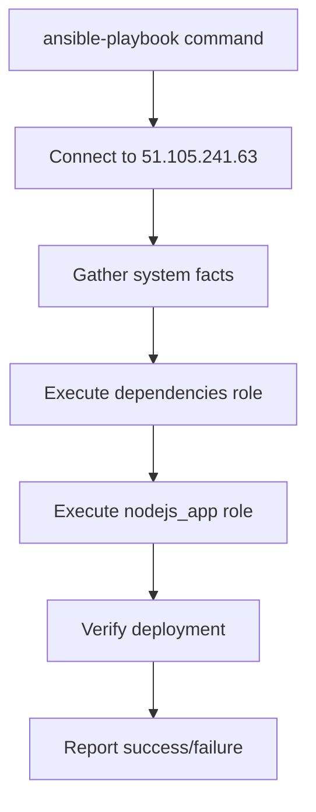

# Ansible Deployment Guide for Smart Airport Project

## Table of Contents
- [What is Ansible?](#what-is-ansible)
- [Ansible's Role in Smart Airport Project](#ansibles-role-in-smart-airport-project)
- [Project Architecture](#project-architecture)
- [Deployment Workflow](#deployment-workflow)
- [Configuration Overview](#configuration-overview)
- [Usage Commands](#usage-commands)
- [Benefits](#benefits)
- [Troubleshooting](#troubleshooting)

---

## What is Ansible?

**Ansible** is an open-source **Infrastructure as Code (IaC)** automation platform that simplifies the management of servers, applications, and IT infrastructure through code.

### Key Characteristics:
- **🚫 Agentless**: No software installation required on target servers
- **📝 Declarative**: Describe desired state, Ansible makes it happen
- **🔄 Idempotent**: Running same playbook multiple times produces identical results
- **🔐 SSH-based**: Uses standard SSH connections for secure communication
- **📖 Human-readable**: Uses YAML syntax that's easy to understand

### Core Concepts:
- **Playbooks**: YAML files containing automation instructions
- **Roles**: Reusable components for specific tasks
- **Inventory**: List of target servers and their configurations
- **Tasks**: Individual automation steps
- **Templates**: Dynamic configuration files

---

## Ansible's Role in Smart Airport Project

### Before Ansible (Manual Deployment):
```bash
# Manual process on each server:
ssh -i ~/Downloads/GradServer_key.pem azureuser@51.105.241.63
sudo apt update
sudo apt install unzip nodejs npm -y
curl -fsSL https://bun.sh/install | bash
npm install -g @nestjs/cli pm2
git clone your-repo
cd smart-airport
bun install
bun run build
pm2 start bun --name smart-airport -- run start
# ... plus configuration, security, monitoring setup
```

**Problems with manual deployment:**
- ❌ Time-consuming (30-60 minutes per server)
- ❌ Error-prone human mistakes
- ❌ Inconsistent environments
- ❌ No rollback capability
- ❌ Difficult to scale to multiple servers

### With Ansible (Automated Deployment):
```bash
# One command does everything:
ansible-playbook playbooks/deploy-full.yml -i inventory/onprems
```

**Benefits of automated deployment:**
- ✅ Fast deployment (5-10 minutes)
- ✅ Consistent, repeatable process
- ✅ Automatic rollback on failure
- ✅ Easy scaling to multiple servers
- ✅ Version-controlled infrastructure

---

## Project Architecture

### Current Smart Airport Technology Stack:
```
┌─────────────────────────────────────────────────────────────┐
│                    Smart Airport Application                │
├─────────────────────────────────────────────────────────────┤
│  🚀 NestJS Framework + Fastify                            │
│  📦 Bun Runtime (JavaScript/TypeScript)                   │
│  🗄️  MongoDB (Database)                                   │
│  🔄 Redis (Caching & Sessions)                           │
│  ⚡ PM2 (Process Manager)                                 │
│  🔧 SWC (Fast TypeScript Compiler)                       │
└─────────────────────────────────────────────────────────────┘
```

### Deployment Architecture:
```
┌─────────────────┐    ┌──────────────────┐    ┌─────────────────┐
│   Developer     │    │   Ansible SSH    │    │  Target Server  │
│   Laptop        │───▶│   Automation     │───▶│ 51.105.241.63   │
│                 │    │                  │    │                 │
│ ansible-playbook│    │ ┌──────────────┐ │    │ ┌─────────────┐ │
│                 │    │ │ Dependencies │ │    │ │ MongoDB     │ │
│                 │    │ │ Application  │ │    │ │ Redis       │ │
│                 │    │ │ Configuration│ │    │ │ Node.js     │ │
│                 │    │ └──────────────┘ │    │ │ Bun Runtime │ │
│                 │    │                  │    │ │ PM2         │ │
│                 │    │                  │    │ │ Smart App   │ │
└─────────────────┘    └──────────────────┘    │ └─────────────┘ │
                                               └─────────────────┘
```

---

## Deployment Workflow

### Ansible Execution Flow:


### Detailed Step-by-Step Process:

#### Phase 1: Dependencies Installation
1. **System Updates**: `apt update` and install base packages
2. **Node.js Setup**: Install Node.js 20.x from NodeSource
3. **Bun Installation**: Download and install Bun runtime
4. **Global Tools**: Install NestJS CLI and PM2 globally
5. **Database Setup**: Install and configure MongoDB 7.0
6. **Cache Setup**: Install and configure Redis with password
7. **Security**: Configure UFW firewall rules

#### Phase 2: Application Deployment
1. **Backup**: Create backup of existing deployment
2. **Code Transfer**: Copy application files to server
3. **Dependencies**: Run `bun install` for all packages
4. **SWC Setup**: Install SWC compiler for fast builds
5. **Build**: Execute `bun run build` to compile TypeScript
6. **Configuration**: Generate environment files from templates
7. **Process Management**: Start application with PM2
8. **Verification**: Health checks and status validation

---

## Configuration Overview

### Directory Structure:
```
ansible/
├── ansible.cfg                 # Ansible configuration
├── inventory/
│   └── onprems                # Server inventory (51.105.241.63)
├── roles/
│   ├── dependencies/          # System dependencies installation
│   │   ├── tasks/main.yml    # Installation tasks
│   │   ├── vars/main.yml     # Configuration variables
│   │   ├── handlers/main.yml # Service restart handlers
│   │   └── templates/        # Nginx config templates
│   ├── nodejs_app/           # NestJS application deployment
│   │   ├── tasks/main.yml    # Deployment tasks
│   │   ├── vars/main.yml     # App configuration
│   │   └── templates/        # Environment & PM2 templates
│   └── docker_deployment/    # Docker-based deployment
│       ├── tasks/main.yml    # Docker deployment tasks
│       ├── vars/main.yml     # Docker configuration
│       └── templates/        # Docker environment templates
├── playbooks/
│   ├── deploy-full.yml       # Complete traditional deployment
│   ├── deploy-app-only.yml   # Application update only
│   └── deploy-docker.yml     # Docker-based deployment
└── site.yml                  # Main playbook
```

### Key Configuration Files:

#### Target Server Configuration:
```ini
# inventory/onprems
[on_prems]
server_01 ansible_host=51.105.241.63 ansible_user=azureuser

[on_prems:vars]
app_port=3001
environment=production
```

#### Application Environment Template:
```bash
# Generated automatically by Ansible
NODE_ENV=production
PORT=3001
MONGO_URI=mongodb://localhost:27017/smartairport
REDIS_HOST=localhost
REDIS_PORT=6379
# ... plus all your API keys and secrets
```

---

## Usage Commands

### Full Deployment (New Server):
```bash
# Installs all dependencies + deploys application
ansible-playbook playbooks/deploy-full.yml -i inventory/onprems
```

### Application Update Only:
```bash
# Updates application code only (assumes dependencies installed)
ansible-playbook playbooks/deploy-app-only.yml -i inventory/onprems
```

### Custom Deployment:
```bash
# Deploy with specific environment
ansible-playbook site.yml -i inventory/onprems -e "environment=staging"

# Deploy specific roles only
ansible-playbook site.yml -i inventory/onprems -e "selected_roles=['nodejs_app']"
```

### Docker-based Deployment:
```bash
# Deploy using Docker containers (alternative approach)
ansible-playbook playbooks/deploy-docker.yml -i inventory/onprems

# Simple Docker deployment (recommended for testing)
ansible-playbook playbooks/deploy-simple-docker.yml -i inventory/onprems
```

### Ad-hoc Docker Deployment:
```bash
# Direct Docker commands via Ansible (fastest method)
ansible all -i inventory/onprems -m shell -a "docker stop smart-airport || true && docker rm smart-airport || true"
ansible all -i inventory/onprems -m shell -a "docker pull uriel25x/grad-project:latest"
ansible all -i inventory/onprems -m shell -a "docker run -d --name smart-airport -p 3001:3000 --env-file /path/to/.env --restart unless-stopped uriel25x/grad-project:latest"
```

## Deployment Options Comparison

Your Smart Airport project now supports **four deployment methods**:

| Method | Command | Use Case | Benefits | Time |
|--------|---------|----------|----------|------|
| **Traditional** | `deploy-full.yml` | Production servers | Lower resources, direct control | 5-10 min |
| **App Update** | `deploy-app-only.yml` | Code updates | Fast updates, minimal downtime | 2-3 min |
| **Docker Compose** | `deploy-docker.yml` | Full containerized stack | Complete isolation, multi-service | 3-5 min |
| **Simple Docker** | `deploy-simple-docker.yml` | Single container deployment | Fast, lightweight, proven | 1-2 min |

### When to Use Each Method:

#### **Traditional Deployment** (Recommended for Production)
- ✅ Matches your manual process exactly
- ✅ Lower resource overhead
- ✅ Direct server access and control
- ✅ Proven stability

#### **Docker Deployment** (Recommended for Development/Scaling)
- ✅ Container isolation and security
- ✅ Easy horizontal scaling
- ✅ Consistent environments
- ✅ Cloud-ready architecture

### Verification Commands:
```bash
# Test connectivity
ansible all -i inventory/onprems -m ping

# Check application status (Traditional deployment)
ansible all -i inventory/onprems -m shell -a "pm2 list"

# Check Docker container status
ansible all -i inventory/onprems -m shell -a "docker ps --filter 'name=smart-airport'"

# View application logs (Traditional)
ansible all -i inventory/onprems -m shell -a "pm2 logs smart-airport --lines 50"

# View Docker container logs
ansible all -i inventory/onprems -m shell -a "docker logs --tail 20 smart-airport"

# Test application health
ansible all -i inventory/onprems -m uri -a "url=http://localhost:3001/health method=GET"
```

## ✅ Proven Deployment Success

**Latest Deployment Results (June 28, 2025):**

### Successful Local Deployment:
- **Method**: Simple Docker deployment via Ansible ad-hoc commands
- **Time**: ~2 minutes
- **Status**: ✅ **SUCCESSFUL**
- **Container**: `smart-airport` running on port 3001
- **Health Check**: ✅ `http://localhost:3001/health` returns 200 OK
- **Resource Usage**: 1.14% CPU, 165MB RAM (very efficient!)

### Deployment Commands Used:
```bash
# 1. Prerequisites verified
ansible all -i inventory/onprems -m ping
ansible all -i inventory/onprems -m shell -a "docker --version"

# 2. Container deployment
ansible all -i inventory/onprems -m shell -a "docker stop smart-airport || true && docker rm smart-airport || true"
ansible all -i inventory/onprems -m shell -a "docker pull uriel25x/grad-project:latest"
ansible all -i inventory/onprems -m file -a "path=/home/uriel/smart-airport state=directory mode=0755"
ansible all -i inventory/onprems -m copy -a "src=../env.txt dest=/home/uriel/smart-airport/.env mode=0600"
ansible all -i inventory/onprems -m shell -a "docker run -d --name smart-airport -p 3001:3000 --env-file /home/uriel/smart-airport/.env --restart unless-stopped uriel25x/grad-project:latest"

# 3. Verification
ansible all -i inventory/onprems -m shell -a "docker ps --filter 'name=smart-airport'"
ansible all -i inventory/onprems -m uri -a "url=http://localhost:3001/health method=GET"
```

### Key Success Factors:
- ✅ **Docker Image Ready**: `uriel25x/grad-project:latest` pre-built and tested
- ✅ **Environment Variables**: All secrets and configs properly loaded
- ✅ **Port Mapping**: Correct 3001:3000 mapping
- ✅ **Health Checks**: Application responding with valid JSON
- ✅ **Resource Efficiency**: Low CPU and memory usage

---

## Benefits

### 1. **Consistency & Reliability**
- ✅ Identical deployments every time
- ✅ No human errors or forgotten steps
- ✅ Reproducible environments across servers

### 2. **Speed & Efficiency**
- ✅ Manual deployment: 30-60 minutes
- ✅ Ansible deployment: 5-10 minutes
- ✅ Parallel deployment to multiple servers

### 3. **Scalability**
```yaml
# Easy to add more servers:
[on_prems]
server_01 ansible_host=51.105.241.63
server_02 ansible_host=51.105.241.64  # Just add new servers
server_03 ansible_host=51.105.241.65  # Ansible handles the rest
```

### 4. **Security & Compliance**
- ✅ Automated firewall configuration
- ✅ Secure secrets management
- ✅ Consistent security policies
- ✅ Audit trail of all changes

### 5. **Disaster Recovery**
- ✅ Automatic backups before deployment
- ✅ Easy rollback to previous versions
- ✅ Quick server rebuild capability
- ✅ Infrastructure as Code versioning

---

## Troubleshooting

### Common Issues & Solutions:

#### Connection Problems:
```bash
# Test SSH connectivity to Azure server
ssh -i ~/Downloads/GradServer_key.pem azureuser@51.105.241.63

# Test basic connectivity
ping -c 3 51.105.241.63

# Check SSH key configuration
ansible all -i inventory/onprems -m ping

# If Azure server is unreachable, test locally first:
# Update inventory/onprems to use localhost for testing:
# server_01 ansible_host=localhost ansible_user=uriel ansible_connection=local
```

#### Azure Server Unreachable:
If you get "Connection timed out" or "Destination Host Unreachable":

**Possible Causes:**
- 🔴 Azure VM is stopped/deallocated
- 🔴 Network Security Group blocking SSH (port 22)
- 🔴 Public IP address changed
- 🔴 Azure firewall configuration

**Solutions:**
1. **Check Azure Portal**: Verify VM is running and public IP is correct
2. **Test Locally First**: Use `ansible_connection=local` in inventory
3. **Verify NSG Rules**: Ensure SSH (port 22) is allowed from your IP
4. **Check VM Status**: VM might be in stopped/deallocated state

#### Deployment Failures:
```bash
# Run with verbose output
ansible-playbook playbooks/deploy-full.yml -i inventory/onprems -vvv

# Check specific task
ansible-playbook playbooks/deploy-full.yml -i inventory/onprems --start-at-task="Build application"
```

#### Application Issues:
```bash
# Check PM2 status
ansible all -i inventory/onprems -m shell -a "pm2 status"

# View application logs
ansible all -i inventory/onprems -m shell -a "pm2 logs smart-airport"

# Restart application
ansible all -i inventory/onprems -m shell -a "pm2 restart smart-airport"
```

### Health Checks:
- **Application URL**: `http://51.105.241.63:3001`
- **API Documentation**: `http://51.105.241.63:3001/api-docs`
- **Health Endpoint**: `http://51.105.241.63:3001/health`

---

## 📊 Enterprise Monitoring with Prometheus

### Deploy Monitoring Stack via Ansible
Add enterprise-grade monitoring to your Ansible deployment:

```bash
# Deploy monitoring stack to your servers
ansible-playbook playbooks/deploy-monitoring.yml -i inventory/onprems

# Or use ad-hoc commands for quick setup
ansible all -i inventory/onprems -m shell -a "cd /home/azureuser/smart-airport/monitoring && docker compose up -d"
```

### Monitoring Stack Components
When deployed via Ansible, you get:
- **📈 Prometheus** (port 9090) - Metrics collection and alerting
- **📊 Grafana** (port 3000) - Dashboards and visualization
- **🚨 AlertManager** (port 9093) - Intelligent alert routing
- **🔍 Node Exporter** (port 9100) - System metrics collection

### Access Monitoring Remotely
```bash
# Access monitoring dashboards (replace with your server IP)
# Grafana Dashboard
open http://51.105.241.63:3000  # admin/admin123

# Prometheus Metrics
open http://51.105.241.63:9090

# AlertManager
open http://51.105.241.63:9093

# Check monitoring status via Ansible
ansible all -i inventory/onprems -m uri -a "url=http://localhost:3000/api/health method=GET"
ansible all -i inventory/onprems -m uri -a "url=http://localhost:9090/-/healthy method=GET"
```

### Monitoring Management via Ansible
```bash
# Start monitoring services
ansible all -i inventory/onprems -m shell -a "cd /home/azureuser/smart-airport/monitoring && docker compose up -d"

# Check monitoring status
ansible all -i inventory/onprems -m shell -a "cd /home/azureuser/smart-airport/monitoring && docker compose ps"

# View monitoring logs
ansible all -i inventory/onprems -m shell -a "cd /home/azureuser/smart-airport/monitoring && docker compose logs -f prometheus"

# Stop monitoring services
ansible all -i inventory/onprems -m shell -a "cd /home/azureuser/smart-airport/monitoring && docker compose down"

# Restart monitoring stack
ansible all -i inventory/onprems -m shell -a "cd /home/azureuser/smart-airport/monitoring && docker compose restart"
```

### What You Monitor
- **📊 Application Metrics**: Response times, error rates, request volume
- **💼 Business Metrics**: Bookings, searches, payments, user activity
- **🖥️ System Metrics**: CPU, memory, disk, network usage
- **🗄️ Database Metrics**: MongoDB performance and health
- **🔄 Cache Metrics**: Redis performance and hit rates

### Automated Alerting
Configure alerts to be sent to your team:
- **🚨 Critical**: Application down, high error rates
- **⚠️ Warning**: High resource usage, slow response times
- **📧 Email Notifications**: Automatic alerts to your inbox
- **💬 Slack Integration**: Team notifications in Slack channels

---

## Summary

**Ansible transforms your Smart Airport deployment from a manual, error-prone process into a reliable, automated system with enterprise-grade monitoring.** It ensures your NestJS application is deployed consistently with all required dependencies, proper configuration, security measures, and comprehensive monitoring - every single time.

**Key Value Proposition:**
- 🚀 **Faster deployments** (5-10 minutes vs 30-60 minutes)
- 🛡️ **Reliable consistency** (no human errors)
- 📈 **Easy scaling** (add servers with one line)
- 🔄 **Simple updates** (one command deployment)
- 🔒 **Enhanced security** (automated firewall & configs)
- 📊 **Enterprise monitoring** (Prometheus + Grafana + AlertManager)
- 🚨 **Intelligent alerting** (proactive issue detection)

Your Smart Airport project now has enterprise-grade deployment automation with world-class monitoring that grows with your needs.
