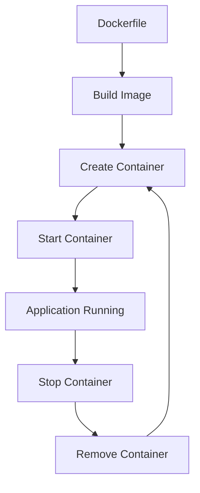

# What is Docker and Its Role in Smart Airport Project

## Table of Contents
- [What is Docker?](#what-is-docker)
- [Docker's Role in Smart Airport Project](#dockers-role-in-smart-airport-project)
- [Project Architecture with Docker](#project-architecture-with-docker)
- [Docker vs Traditional Deployment](#docker-vs-traditional-deployment)
- [Benefits for Your Project](#benefits-for-your-project)
- [Real-World Usage](#real-world-usage)
- [Docker Workflow](#docker-workflow)
- [Summary](#summary)

---

## What is Docker?

**Docker** is a **containerization platform** that packages applications and their dependencies into lightweight, portable containers that can run consistently across different environments.

### Key Concepts:

#### **🐳 Container**
Think of a container as a **lightweight virtual machine** that includes:
- Your application code
- Runtime environment (Node.js, Bun)
- System libraries and dependencies
- Configuration files

#### **📦 Image**
A **blueprint** for creating containers. Like a recipe that defines:
- What operating system to use
- What software to install
- How to configure the application
- What commands to run

#### **🏗️ Dockerfile**
A **text file with instructions** to build an image:
```dockerfile
FROM node:18-alpine          # Start with Node.js
COPY . /app                  # Copy your code
RUN npm install             # Install dependencies
CMD ["npm", "start"]        # Start the application
```

#### **🎼 Docker Compose**
A **tool to manage multiple containers** as a single application:
```yaml
services:
  backend:    # Your NestJS app
  mongodb:    # Database
  redis:      # Cache
```

### Core Characteristics:
- **🚀 Lightweight**: Shares host OS kernel, faster than VMs
- **📦 Portable**: Runs the same everywhere (laptop, server, cloud)
- **🔒 Isolated**: Each container is separate and secure
- **⚡ Fast**: Quick startup and deployment
- **🔄 Consistent**: Same environment in development and production

---

## Docker's Role in Smart Airport Project

### Before Docker (Your Current Setup):
```bash
# Manual setup on each machine:
sudo apt update
sudo apt install nodejs npm mongodb redis
npm install -g @nestjs/cli pm2
git clone your-repo
cd smart-airport
bun install
bun run build
pm2 start bun --name smart-airport -- run start
# Configure MongoDB, Redis, environment variables...
```

**Problems with traditional setup:**
- ❌ **"Works on my machine"** - Different environments cause issues
- ❌ **Complex setup** - Many steps, easy to miss something
- ❌ **Dependency conflicts** - Different versions of Node.js, MongoDB, etc.
- ❌ **Hard to scale** - Manual setup for each new server
- ❌ **Environment drift** - Configurations change over time

### With Docker (New Option):
```bash
# One command sets up everything:
docker compose up -d
```

**Benefits of Docker approach:**
- ✅ **Identical environments** - Same container everywhere
- ✅ **Simple setup** - One command deployment
- ✅ **No conflicts** - Each service in its own container
- ✅ **Easy scaling** - Add more containers as needed
- ✅ **Version control** - Infrastructure as code

---

## Project Architecture with Docker

### Your Smart Airport Docker Setup:

```
┌─────────────────────────────────────────────────────────────┐
│                    Docker Environment                       │
│                                                             │
│  ┌─────────────────┐  ┌─────────────────┐  ┌─────────────────┐ │
│  │   Backend       │  │    MongoDB      │  │     Redis       │ │
│  │   Container     │  │   Container     │  │   Container     │ │
│  │                 │  │                 │  │                 │ │
│  │ 🚀 NestJS       │  │ 🗄️ Database    │  │ 🔄 Cache       │ │
│  │ 📦 Bun Runtime  │  │ 📊 Collections │  │ ⚡ Sessions    │ │
│  │ 🔧 Your Code    │  │ 🔍 Indexes     │  │ 🔒 Password    │ │
│  │ 🌐 Port 3001    │  │ 🌐 Port 27017  │  │ 🌐 Port 6379   │ │
│  └─────────────────┘  └─────────────────┘  └─────────────────┘ │
│           │                     │                     │        │
│           └─────────────────────┼─────────────────────┘        │
│                                 │                              │
│  ┌─────────────────────────────────────────────────────────┐   │
│  │              Docker Network                             │   │
│  │         (Internal Communication)                       │   │
│  └─────────────────────────────────────────────────────────┘   │
└─────────────────────────────────────────────────────────────┘
```

### Container Breakdown:

#### **1. Backend Container (`smart-airport-backend`)**
```dockerfile
# What it contains:
- Alpine Linux (lightweight OS)
- Bun runtime
- Your NestJS application code
- Built application (dist/ folder)
- Environment configuration
- Health check endpoint
```

**What it does:**
- ✅ Runs your Smart Airport NestJS application
- ✅ Handles API requests on port 3001
- ✅ Connects to MongoDB and Redis containers
- ✅ Serves your booking, payment, and user APIs

#### **2. MongoDB Container (`smart-airport-mongodb`)**
```yaml
# What it contains:
- MongoDB 7.0 database server
- Initialization scripts
- Persistent data storage
- Database collections and indexes
```

**What it does:**
- ✅ Stores user accounts, bookings, flights data
- ✅ Automatically creates collections and indexes
- ✅ Provides database on port 27017
- ✅ Maintains data persistence across restarts

#### **3. Redis Container (`smart-airport-redis`)**
```yaml
# What it contains:
- Redis 7.2 server
- Password protection
- Persistent storage configuration
```

**What it does:**
- ✅ Caches frequently accessed data
- ✅ Stores user sessions
- ✅ Provides fast data access on port 6379
- ✅ Improves application performance

---

## Docker vs Traditional Deployment

### Comparison Table:

| Aspect | Traditional (PM2) | Docker Containers |
|--------|------------------|-------------------|
| **Setup Complexity** | High (many manual steps) | Low (one command) |
| **Environment Consistency** | Variable (depends on setup) | Identical everywhere |
| **Dependency Management** | Manual installation | Automated in containers |
| **Scaling** | Manual PM2 clustering | Container orchestration |
| **Isolation** | Process-level | Container-level |
| **Resource Usage** | Lower overhead | Slightly higher |
| **Debugging** | Direct server access | Container logs/exec |
| **Rollback** | Backup-based | Image-based |
| **Team Onboarding** | Complex setup docs | `docker compose up` |
| **Cloud Deployment** | Server-specific | Cloud-native |

### Real-World Scenarios:

#### **Scenario 1: New Developer Joins Team**

**Traditional Approach:**
```bash
# New developer needs to:
1. Install Node.js (correct version)
2. Install MongoDB (configure it)
3. Install Redis (configure it)
4. Clone repository
5. Install dependencies
6. Configure environment variables
7. Start all services manually
8. Debug inevitable setup issues
# Time: 2-4 hours, often with problems
```

**Docker Approach:**
```bash
# New developer needs to:
1. Install Docker
2. Clone repository
3. Run: docker compose up -d
# Time: 10 minutes, works every time
```

#### **Scenario 2: Deploying to New Server**

**Traditional Approach:**
```bash
# Server setup requires:
1. Install and configure OS packages
2. Install Node.js, MongoDB, Redis
3. Configure services and security
4. Deploy application code
5. Configure environment
6. Start and monitor services
# Time: 30-60 minutes per server
```

**Docker Approach:**
```bash
# Server setup requires:
1. Install Docker
2. Deploy containers: docker compose up -d
# Time: 5-10 minutes per server
```

---

## Benefits for Your Project

### 1. **Development Benefits**
- ✅ **Instant Environment**: New developers productive in minutes
- ✅ **No "Works on My Machine"**: Identical containers everywhere
- ✅ **Easy Testing**: Spin up clean environment for each test
- ✅ **Multiple Versions**: Run different versions side by side

### 2. **Production Benefits**
- ✅ **Consistent Deployment**: Same container in dev, staging, production
- ✅ **Easy Scaling**: Add more backend containers as traffic grows
- ✅ **Quick Rollback**: Switch to previous container version instantly
- ✅ **Resource Efficiency**: Better resource utilization

### 3. **Operational Benefits**
- ✅ **Simplified Monitoring**: Container-level metrics and logs
- ✅ **Easy Updates**: Update one service without affecting others
- ✅ **Disaster Recovery**: Recreate entire environment quickly
- ✅ **Cloud Ready**: Easy migration to AWS, Azure, Google Cloud

### 4. **Team Benefits**
- ✅ **Reduced Setup Time**: From hours to minutes
- ✅ **Fewer Support Issues**: Consistent environments
- ✅ **Better Collaboration**: Everyone uses same setup
- ✅ **Focus on Code**: Less time on environment issues

---

## Real-World Usage

### Daily Development Workflow:

```bash
# Start your development environment
cd smart-airport/docker
./setup.sh start

# Your application is now running:
# - Backend: http://localhost:3001
# - MongoDB: localhost:27017
# - Redis: localhost:6379

# Make code changes...
# Container automatically rebuilds and restarts

# View logs
./setup.sh logs

# Stop when done
./setup.sh stop
```

### Production Deployment:

```bash
# Deploy to production server via Ansible
cd ansible
ansible-playbook playbooks/deploy-docker.yml -i inventory/onprems

# Or deploy directly
ssh user@51.105.241.63
cd smart-airport-docker
docker compose up -d --build
```

### Scaling Your Application:

```bash
# Scale backend to handle more traffic
docker compose up -d --scale backend=3

# Now you have 3 backend containers sharing the load
```

---

## Docker Workflow

### Development Cycle:


### Container Lifecycle:


---

## Summary

### Docker's Value to Your Smart Airport Project:

**Docker transforms your development and deployment from:**
- ❌ **Complex, manual, error-prone setup**
- ❌ **Environment inconsistencies**
- ❌ **Difficult scaling and maintenance**
- ❌ **Time-consuming onboarding**

**To:**
- ✅ **Simple, automated, reliable deployment**
- ✅ **Identical environments everywhere**
- ✅ **Easy scaling and updates**
- ✅ **Instant team onboarding**

### Key Takeaway:
**Docker is like having a "shipping container" for your application** - it packages everything your Smart Airport app needs (code, runtime, database, cache) into standardized containers that run the same way everywhere, making development faster and deployment more reliable.

### Your Options:
1. **Keep Traditional**: Use Ansible with PM2 (current approach)
2. **Add Docker**: Use Docker for development, traditional for production
3. **Go Full Docker**: Use Docker everywhere for maximum consistency

**Docker doesn't replace your current setup - it provides a modern alternative that grows with your needs.**
